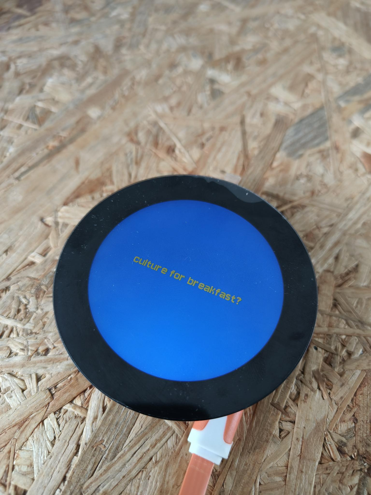

The [HyperPixel2r](https://www.elektor.com/hyperpixel-2-1-round-hi-res-display-for-raspberry-pi) from Pimoroni is a round 2.1” IPS capacitive touchscreen with high-speed DPI interface. Like its square and rectangular HyperPixel 4 brothers, the 2r is intended for Raspberry Pi. Actually, the size is optimized for the Raspberry Pi Zero and Zero 2W but, as it has the standard 40-pin HAT connector, it can be plugged on any Raspberry Pi equipped with such a connector as long as you are careful about the mechanical side of things.

It has 18-bit color depth (meaning 262,144 colors) and supports up to 60 frames per second (FPS). The viewing area has a 2.1” or 53.3 mm diameter and a viewing angle of 175°. Its full diameter is 72 mm with a height of 11 mm. With a Pi Zero attached with short stand-offs, the total height (or depth, whatever you prefer) is 17 mm.

As the display uses almost every pin of the HAT connector, you cannot add other extension boards. However, the display does provide an alternate I2C port for connecting things to.

In this project, I'm using the Hyperpixel with the **Raspi Zero W**.

The drivers only work with **Raspberry Pi OS Buster** (last time I checked). So burn an SD card with the [legacy OS](https://downloads.raspberrypi.com/raspios_lite_armhf/images/raspios_lite_armhf-2021-05-28/). (supposedly support for Bullseye is being worked on).
It's easiers to work with [SSH](https://www.raspberrypi.com/documentation/computers/remote-access.html#introduction-to-remote-access). So set-up everything correctly during set-up.

## basic set-up

Make sure to update after a fresh install
```
$ sudo apt install python3-pip
$ sudo apt install git
$ sudo apt update
$ sudo apt upgrade
```
**Make sure that the the I2C interface is enabled on your Raspberry Pi. You can do this by running sudo raspi-config, navigating to "Interfacing Options", and enabling the I2C interface.**

Next, to use the HyperPixel 2r on a Raspberry Pi you must install a driver: 
```
$ git clone https://github.com/pimoroni/hyperpixel2r
$ cd hyperpixel2r
$ sudo ./install.sh
$ sudo reboot
```
To use the display in your own python applications, install Pimoroni's ```hyperpixel2r-python``` library:
```
$ git clone https://github.com/pimoroni/hyperpixel2r-python
$ cd hyperpixel2r-python
$ sudo ./install.sh
```

Try it out
```
$ cd hyperpixel2r-python/examples
$ python3 demo.py
$ python3 clock.py
$ python3 hue.py
```


If the library examples look funny, upgrade pygame:
```
$ sudo python3 -m pip install pygame --upgrade
```
## tests
### adding text
Adding text with custom fonts is rather straightforward. See [pygame test 2](tests/pygame_test2_text.py).



### working with animated sprites
To work with gif files, I needed to install a couple of dependencies first. To solve this error message:   
```Python
# Python error message
pygame.error: File is not a Windows BMP file   
image = pygame.image.load(image_path).convert_alpha()
```

**Solution**   
Install pygame dependencies. After that it should work. See example [pygame test 3](tests/pygame_test3_animatedsprites.py).
```
 $ sudo apt install libsdl2-dev libsdl2-mixer-dev libsdl2-gfx-dev libsdl2-image-dev libsdl2-net-dev libsdl2-ttf-dev
```


